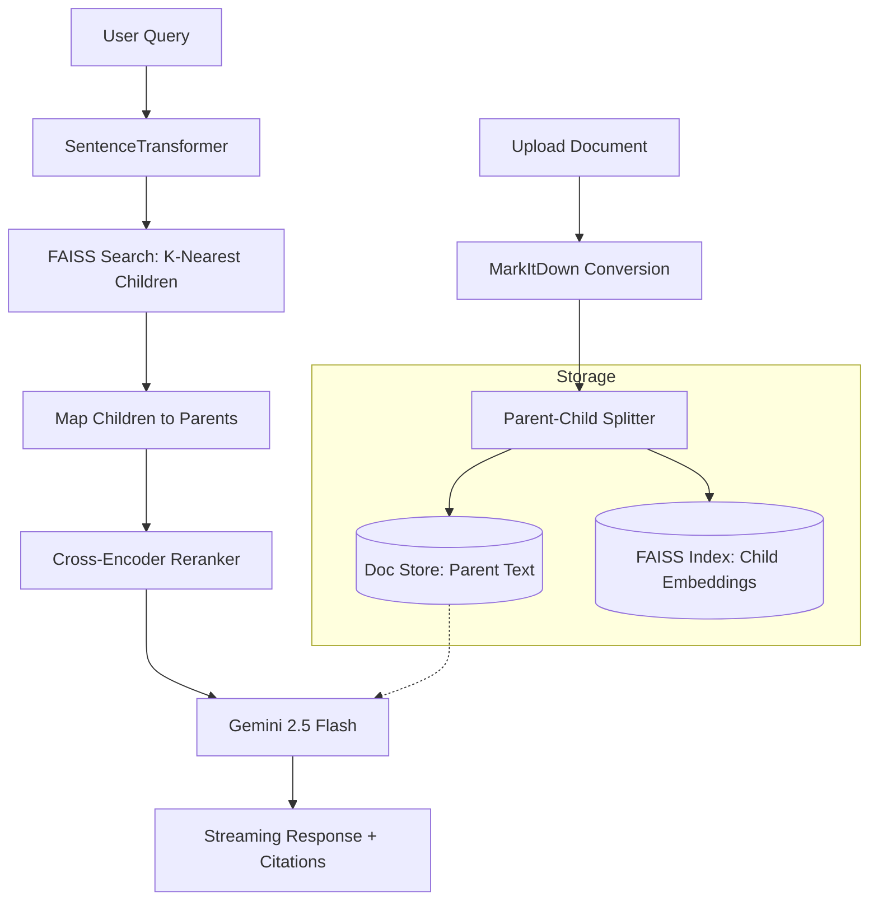

# NanoRAG: Intelligent Document Analysis 🧠

## Introduction

NanoRAG is a specialized Retrieval-Augmented Generation (RAG) application designed to streamline the way researchers and students interact with academic papers. I built this project to study complex documents more effectively and to gain a hands-on understanding of how Large Language Models (LLMs) leverage external context to ground their responses.

By implementing a **Parent-Child chunking strategy**, NanoRAG ensures that the AI has access to the broader context of a document while maintaining high precision during the vector search phase.

## 🚀 Key Features

- **Parent-Child Retrieval**: Decouples the text used for embedding (small child chunks) from the text used for generation (large parent contexts) to provide the LLM with better context.
- **Semantic Search & Reranking**: Combines FAISS for high-speed vector similarity with a Cross-Encoder reranker to ensure the most relevant information is prioritized.
- **Multi-Format Ingestion**: Seamlessly processes PDFs, Word documents (DOCX), PowerPoints (PPTX), and Text files using the MarkItDown library.
- **Streaming Responses**: Real-time response generation using Gemini 1.5 Flash for a fast, interactive chat experience.
- **Source Attribution**: Automatically cites the specific context and file name used to generate each part of the answer, ensuring academic integrity.

## 🛠️ Technical Stack

### Core Libraries

| Category | Library | Purpose |
|----------|---------|---------|
| Frontend | Streamlit | Interactive web interface and state management. |
| Vector DB | FAISS | Efficient similarity search for dense vectors. |
| Embeddings | SentenceTransformers | Generating vector representations using all-MiniLM-L6-v2. |
| Reranking | Cross-Encoder | Refined scoring of retrieved documents using ms-marco-MiniLM-L-6-v2. |
| Parsing | MarkItDown | Microsoft's tool for converting various file formats to Markdown. |
| LLM API | Google GenAI | Powering final reasoning and synthesis via Gemini. |

### Technical Details

**Chunking Logic:**
- Parent Size: 2000 characters (for LLM context window)
- Child Size: 400 characters (for granular embedding/matching)
- Overlap: 50 characters to maintain continuity between chunks

**Retrieval Flow:** The system performs a similarity search on children, retrieves their associated parent text, and then reranks those parents based on the original query.

## 📊 System Architecture

The following diagram illustrates the data flow from document ingestion to the final generated response:



## 🚀 Getting Started

1. **Clone the repository**
   ```bash
   git clone https://github.com/yourusername/nanorag.git
   cd nanorag
   ```

2. **Install dependencies**
   ```bash
   pip install -r requirements.txt
   ```

3. **Run the application**
   ```bash
   streamlit run app.py
   ```

4. **Configure API**: Enter your `GEMINI_API_KEY` in the sidebar interface.

## 📦 Requirements

```txt
streamlit
faiss-cpu
sentence-transformers
markitdown
google-generativeai
```

## 🤝 Contributing

Contributions are welcome! Please feel free to submit a Pull Request.

## 📄 License

This project is licensed under the MIT License - see the LICENSE file for details.

