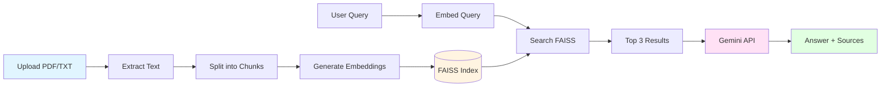

# SimpleRAG

A straightforward Retrieval-Augmented Generation (RAG) system deployed with Streamlit that lets you upload documents and ask questions about their content. Uses Google's Gemini API for generation, Sentence Transformers for embeddings, and FAISS for vector search.

## What It Does

SimpleRAG takes your PDF or text documents, breaks them into chunks, converts them into embeddings, and stores them in a vector database. When you ask a question, it finds the most relevant chunks and feeds them to Gemini to generate an answer based on your actual documents.

Think of it as giving an AI assistant a temporary memory of your specific documents for the duration of your session.

## Features

- **Multiple document support**: Upload PDFs and TXT files
- **Configurable chunking**: Choose between word-based or sentence-aware chunking strategies
- **Flexible retrieval**: Adjust how many sources to retrieve and how strict the similarity matching should be
- **Three response modes**:
  - **Strict**: Only uses the retrieved context, no external knowledge
  - **Balanced**: Primarily uses context but can supplement with general knowledge
  - **Creative**: Uses context as a foundation but freely incorporates broader knowledge
- **Source citation enforcement**: Optionally requires the model to cite sources and confirm it reviewed all documents
- **Chat interface**: Conversational UI with persistent chat history
- **Source transparency**: View which document chunks were used for each answer

## How It's Implemented

### Architecture Overview


### Core Components

**1. Document Processing Pipeline**

- **PDF extraction**: Uses PyPDF2 to extract text from PDFs with validation
- **Chunking**: Two strategies available:
  - **Word mode**: Simple sliding window over words with configurable overlap
  - **Sentence mode**: Attempts to preserve sentence boundaries while respecting chunk size limits
- **Overlap**: Maintains context between chunks by including words from the previous chunk

**2. Embedding & Vector Store**

- **Model**: `all-MiniLM-L6-v2` from Sentence Transformers (384 dimensions)
  - Lightweight and fast
  - Good balance between performance and quality
  - Cached using `@st.cache_resource` for efficiency
- **Vector DB**: FAISS with `IndexFlatL2` (exact L2 distance search)
  - No approximation, guarantees finding true nearest neighbors
  - Works well for smaller document collections

**3. Retrieval**

- Encodes user query using the same embedding model
- Searches FAISS index for top-k nearest neighbors
- Filters results by similarity threshold (L2 distance)
- Lower distance = more similar

**4. Generation**

- Uses Google's `gemini-2.5-flash` model
- Constructs prompt with:
  - System instructions based on selected response mode
  - Retrieved document chunks with source labels
  - Citation requirements (if enabled)
  - User question
- Returns generated answer

**5. Session State Management**

All data is stored in Streamlit's session state:
- `documents`: List of text chunks with metadata
- `embeddings`: Numpy array of document embeddings
- `index`: FAISS index object
- `chat_history`: Conversation history

## What's Missing & Limitations

### Missing Features

**1. Persistence**
- No database backing - everything lives in memory
- Refresh the page and your documents are gone
- No way to save/load document collections
- Chat history disappears on refresh

**2. Advanced Retrieval**
- No reranking step to improve relevance
- No query expansion or reformulation
- No hybrid search (keyword + semantic)
- No metadata filtering (can't filter by document name, date, etc.)

**3. Document Management**
- Can't delete individual documents
- Can't view/manage uploaded documents
- No duplicate detection
- No document versioning

**4. Evaluation & Monitoring**
- No metrics on retrieval quality
- No way to provide feedback on answers
- No logging of queries/answers
- Can't see which sources were actually useful

**5. Production Features**
- No authentication/user management
- No rate limiting
- No error handling for API limits
- No async processing for large uploads
- No progress indicators for long-running operations

**6. Advanced RAG Techniques**
- No multi-hop reasoning
- No query decomposition for complex questions
- No self-reflection or answer validation
- No context compression/summarization

### Current Limitations

**Technical Limitations**

1. **Scalability**
   - FAISS `IndexFlatL2` requires full index in memory
   - Linear time complexity for search (O(n))
   - Not suitable for >10k documents
   - All embeddings must fit in RAM

2. **PDF Extraction**
   - Struggles with scanned PDFs (no OCR)
   - Can't handle images, tables, or complex layouts
   - May mangle text from multi-column layouts
   - No support for other formats (DOCX, HTML, etc.)

3. **Chunking Issues**
   - Fixed-size chunks can break semantic units mid-thought
   - Sentence mode uses naive regex splitting (fails on abbreviations, etc.)
   - No semantic chunking (based on topic boundaries)
   - Overlap is crude - may duplicate irrelevant content

4. **Context Window**
   - Limited by Gemini's context window (~1M tokens, but using only top-k chunks)
   - No intelligent context packing or prioritization
   - May miss relevant information if it's in chunk k+1

5. **Embedding Model**
   - `all-MiniLM-L6-v2` is decent but not state-of-the-art
   - Not fine-tuned for specific domains
   - Single vector per chunk loses nuance
   - English-only

6. **Search Quality**
   - L2 distance may not be optimal for semantic similarity
   - No consideration of query-document interaction
   - Threshold is arbitrary and dataset-dependent
   - No way to handle out-of-domain queries gracefully

**User Experience Limitations**

1. **No streaming**: Answers appear all at once after generation completes
2. **Session-only**: Can't resume conversations across sessions
3. **No export**: Can't export chat history or sources
4. **Limited feedback**: No way to mark answers as helpful/unhelpful
5. **API key exposure**: Must enter API key in UI (security concern for shared deployments)

**Prompt Engineering Limitations**

1. **Citation enforcement is fragile**: Model may ignore instructions despite explicit requirements
2. **No few-shot examples**: Could improve output quality with examples
3. **Mode switching is crude**: Just changes system prompt text
4. **No chain-of-thought**: Model doesn't explain its reasoning process

## Installation
Before following the instructions below, it is recommended that you create a virtual environment first.

```bash
# Clone the repo
git clone https://github.com/Kaynaaf/SimpleRAG.git
cd simplerag

# Install dependencies
pip install -r requirements.txt

# Set API key (optional - can also enter in UI)
export GEMINI_API_KEY="your-api-key-here"

# Run the app
streamlit run app.py
```

## Usage

1. **Get a Gemini API key** from [Google AI Studio](https://aistudio.google.com/app/apikey)
2. Enter your API key in the sidebar (or set the `GEMINI_API_KEY` environment variable)
3. Upload PDF or TXT files
4. Click "Process Documents"
5. Ask questions in the chat interface
6. View retrieved sources by expanding the sources section under each answer

## Configuration Tips

- **Chunk size**: Larger chunks (500-1000 words) for broader context, smaller (200-300) for precise retrieval
- **Overlap**: 10-20% of chunk size is usually good
- **Top-k**: Start with 3-5, increase if answers lack context
- **Similarity threshold**: Lower (1.0-1.5) for strict matching, higher (2.0-3.0) for broader retrieval
- **Response mode**:
  - Use "Strict" for fact-checking or when accuracy is critical
  - Use "Balanced" for general Q&A
  - Use "Creative" for brainstorming or when documents provide background only

## Technical Stack

- **Streamlit**: Web interface
- **Google Generative AI**: LLM for answer generation
- **Sentence Transformers**: Text embeddings
- **FAISS**: Vector similarity search
- **PyPDF2**: PDF text extraction
- **NumPy**: Array operations

## Future Improvements

If I were to continue building this:

1. Add PostgreSQL + pgvector for persistence (though its overkill for a simple demo)
2. Implement proper reranking with a cross-encoder
3. Add document management UI
4. Switch to streaming responses
5. Add usage analytics and feedback collection
6. Implement semantic chunking
7. Add support for more file types (DOCX, HTML, Markdown)
8. Use better embeddings (e.g., `bge-large` or OpenAI embeddings)
9. Add query decomposition for complex questions
10. Implement proper authentication and multi-user support


---

**Note**: This is a demo/prototype. Don't use it for anything critical without adding proper error handling, security, and testing.
